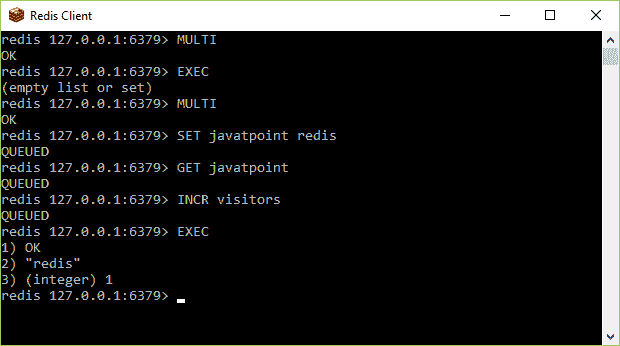

# 重试事务处理

> 哎哎哎:# t0]https://www . javatppoint . com/redis-transaction

Redis 事务用于方便用户在一个步骤中执行一组命令。

执行有两个属性:

*   事务中的所有命令都作为一个单独的操作顺序执行。您不能在执行 Redis 事务的过程中由另一个客户端发出请求。
*   Redis 事务也是原子的。原子意味着要么处理所有命令，要么不处理任何命令。

## 样品

在 Redis 中，事务通过使用“MULTI”命令启动，然后您需要传递一个应该在事务中执行的命令列表，之后整个事务通过“EXEC”命令执行。


## 例子

让我们举个例子来看看 Redis 事务是如何启动和执行的。

**例**

```
redis 127.0.0.1:6379> MULTI
OK
redis 127.0.0.1:6379> EXEC
(empty list or set)
redis 127.0.0.1:6379> MULTI
OK
redis 127.0.0.1:6379> SET javatpoint redis
QUEUED
redis 127.0.0.1:6379> GET javatpoint
QUEUED
redis 127.0.0.1:6379> INCR visitors
QUEUED
redis 127.0.0.1:6379> EXEC
1) OK
2) "redis"
3) (integer) 1

```



* * *

## 重做事务命令

下面是 Redis 事务的一些基本命令列表。

| 索引 | 命令 | 描述 |
| one | 抛弃 | 它用于丢弃 MULTI 后发出的所有命令 |
| Two | 高级管理人员 | 它用于执行 MULTI 之后发出的所有命令 |
| three | 多（前缀） | 它用于标记事务块的开始 |
| four | UNWATCH | 它用来忘记所有关注的键 |
| five | 手表钥匙...] | 它用于监视给定的键，以确定多/执行块的执行 |