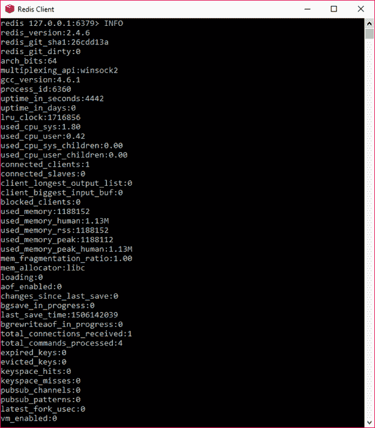

# 重定向服务器

> 哎哎哎:# t0]https://www . javatppoint . com/redis-server

Redis 服务器命令用于管理 Redis 服务器。有不同的服务器命令可用于获取服务器信息、统计数据和服务器的其他特征。

## 例子

让我们举一个例子来看看如何获得关于服务器的所有统计数据和信息。

```
redis 127.0.0.1:6379> ping
PONG
redis 127.0.0.1:6379> AUTH "password"
(error) ERR Client sent AUTH, but no password is set
redis 127.0.0.1:6379> PING
PONG
redis 127.0.0.1:6379> ECHO "Welcome to Javatpoint"
"Welcome to Javatpoint"
redis 127.0.0.1:6379> INFO
redis_version:2.4.6
redis_git_sha1:26cdd13a
redis_git_dirty:0
arch_bits:64
multiplexing_api:winsock2
gcc_version:4.6.1
process_id:6360
uptime_in_seconds:4442
uptime_in_days:0
lru_clock:1716856
used_cpu_sys:1.80
used_cpu_user:0.42
used_cpu_sys_children:0.00
used_cpu_user_children:0.00
connected_clients:1
connected_slaves:0
client_longest_output_list:0
client_biggest_input_buf:0
blocked_clients:0
used_memory:1188152
used_memory_human:1.13M
used_memory_rss:1188152
used_memory_peak:1188112
used_memory_peak_human:1.13M
mem_fragmentation_ratio:1.00
mem_allocator:libc
loading:0
aof_enabled:0
changes_since_last_save:0
bgsave_in_progress:0
last_save_time:1506142039
bgrewriteaof_in_progress:0
total_connections_received:1
total_commands_processed:4
expired_keys:0
evicted_keys:0
keyspace_hits:0
keyspace_misses:0
pubsub_channels:0
pubsub_patterns:0
latest_fork_usec:0
vm_enabled:0
role:master

```



* * *

## 重定向服务器命令

下面是 Redis 数据库中使用的一些服务器命令的列表:

| 索引 | 命令 | 描述 |
| one | BGREWRITEAOF | 该命令用于异步重写仅追加文件。 |
| Two | 断续器 | 此命令用于将数据集异步保存到磁盘。 |
| three | CLIENT KILL [ip:端口] [ID client-id] | 此命令用于终止客户端的连接。 |
| four | 客户名单 | 此命令用于获取到服务器的客户端连接列表。 |
| five | 客户端获取名称 | 此命令用于获取当前连接的名称。 |
| six | 客户端暂停超时 | 此命令用于在指定时间内停止处理来自客户端的命令。 |
| seven | 客户端设置名称连接-名称 | 此命令用于设置当前连接名称。 |
| eight | 集群插槽 | 此命令用于获取群集插槽到节点映射的数组。 |
| nine | 命令 | 此命令用于获取 Redis 命令详细信息的数组。 |
| Ten | 命令计数 | 该命令用于获取 Redis 命令的总数。 |
| Eleven | 命令 GETKEYS | 该命令用于提取给定完整 Redis 命令的密钥。 |
| Twelve | 断续器 | 此命令用于将数据集异步保存到磁盘。 |
| Thirteen | 命令信息命令名[命令名...] | 该命令用于获取特定 Redis 命令细节的数组。 |
| Fourteen | 配置获取参数 | 此命令用于获取配置参数的值。 |
| Fifteen | CONFIG REWRITE | 该命令用于用内存中的配置重写配置文件。 |
| Sixteen | 配置设置参数值 | 该命令用于将配置参数设置为给定值。 |
| Seventeen | 配置复位器 | 此命令用于重置 INFO 返回的统计信息。 |
| Eighteen | 键总数 | 此命令用于返回所选数据库中的键的数量。 |
| Nineteen | 调试对象键 | 此命令用于获取某个键的调试信息。 |
| Twenty | 调试安全故障 | 此命令用于使服务器崩溃。 |
| Twenty-one | 弗洛什 | 此命令用于从所有数据库中删除所有密钥。 |
| Twenty-two | 氟什 DB | 此命令用于从当前数据库中删除所有密钥。 |
| Twenty-three | 信息[部分] | 此命令用于获取有关服务器的信息和统计数据。 |
| Twenty-four | lastssave | 此命令用于检索上次成功保存到磁盘的 UNIX 时间戳。 |
| Twenty-five | 班长 | 该命令用于实时监听服务器收到的所有请求。 |
| Twenty-six | 作用 | 此命令用于在复制上下文中返回实例的角色。 |
| Twenty-seven | 救援 | 此命令用于将数据集同步保存到磁盘。 |
| Twenty-eight | 关机 [无保存] [保存] | 此命令用于将数据集同步保存到磁盘，然后关闭服务器。 |
| Twenty-nine | 主机端口的从属 | 此命令用于使服务器成为另一个实例的从属实例，或者将其提升为主实例。 |
| Thirty | SLOWLOG 子命令[参数] | 该命令用于管理 Redis 慢速查询日志。 |
| Thirty-one | 同步 | 此命令用于复制。 |
| Thirty-two | 时间 | 此命令用于返回当前服务器时间。 |